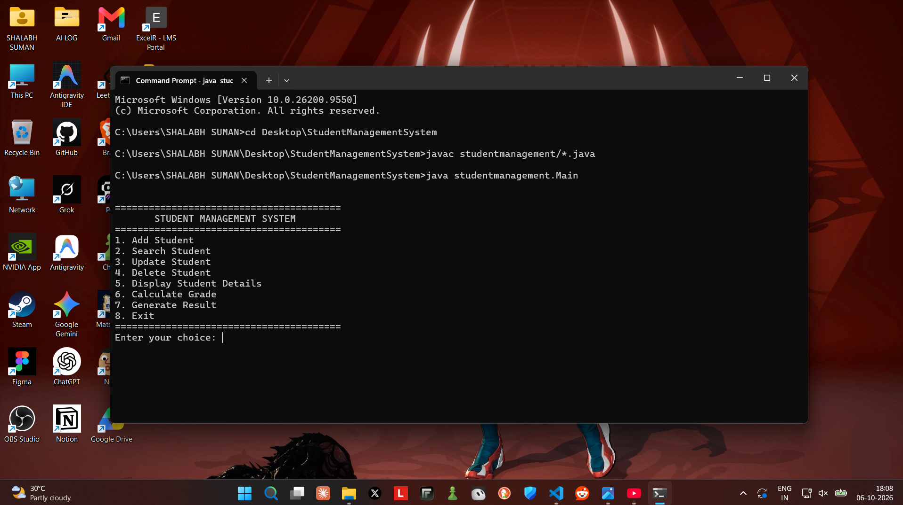

# Student Management System

A simple Java console-based application for managing student records.

## Screenshot



## Features
- Add Student
- Search Student
- Update Student
- Delete Student
- Display Student Details
- Calculate Grade
- Generate Result

## Concepts Used
- Classes & Objects
- Constructors
- Method Overloading
- Inheritance
- Interface
- Packages
- Static Members
- Access Specifiers

## Technologies
- Java
- OOP
- ArrayList

## Run

Compile:
```bash
javac studentmanagement/*.java
